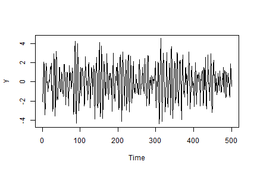
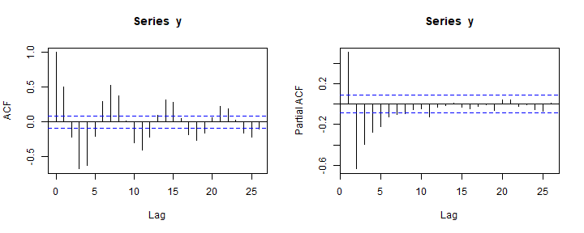

(e) In R, simulate a series of 500 observations from the ARMA(2,1) process with variance = 1.Be sure to use the set.seed function so that you can reproduce your results and use set.seed(6). For the simulated series,


```r
set.seed(6)
y <- arima.sim(model = list(ar = c(1.2, -0.8), ma = c(-0.8)), n = 500, sd = 1)
```

(i) Plot the series.




(ii) Plot the sample ACF and sample PACF



(iii) Compare the sample ACF and PACF values for k = 0, 1, 2, 3 to the theoretical
values from (a) and (c). For the comparison, you should make 2 tables with 3 columns
that give: the theoretical values, the sample values, and the absolute value of the difference between the theoretical and the sample values. Feel free (not required) to add another column that you think would be informative.

#### Table of Sample and Theoretical ACF

<table class="table table-bordered" style="width: auto !important; margin-left: auto; margin-right: auto;">
 <thead>
  <tr>
   <th style="text-align:left;"> k </th>
   <th style="text-align:right;"> Sample ACF </th>
   <th style="text-align:right;"> Theoretical ACF </th>
   <th style="text-align:right;"> Different </th>
  </tr>
 </thead>
<tbody>
  <tr>
   <td style="text-align:left;"> 1 </td>
   <td style="text-align:right;"> 1.000 </td>
   <td style="text-align:right;"> 1.000 </td>
   <td style="text-align:right;"> 0.000 </td>
  </tr>
  <tr>
   <td style="text-align:left;"> 2 </td>
   <td style="text-align:right;"> 0.509 </td>
   <td style="text-align:right;"> 0.512 </td>
   <td style="text-align:right;"> 0.003 </td>
  </tr>
  <tr>
   <td style="text-align:left;"> 3 </td>
   <td style="text-align:right;"> -0.212 </td>
   <td style="text-align:right;"> -0.186 </td>
   <td style="text-align:right;"> 0.026 </td>
  </tr>
  <tr>
   <td style="text-align:left;"> 4 </td>
   <td style="text-align:right;"> -0.673 </td>
   <td style="text-align:right;"> -0.633 </td>
   <td style="text-align:right;"> 0.041 </td>
  </tr>
</tbody>
</table>


#### Table of Sample and Theoretical PACF

<table class="table table-bordered" style="width: auto !important; margin-left: auto; margin-right: auto;">
 <thead>
  <tr>
   <th style="text-align:left;"> k </th>
   <th style="text-align:right;"> Sample PACF </th>
   <th style="text-align:right;"> Theoretical PACF </th>
   <th style="text-align:right;"> Different </th>
  </tr>
 </thead>
<tbody>
  <tr>
   <td style="text-align:left;"> 1 </td>
   <td style="text-align:right;"> 1.000 </td>
   <td style="text-align:right;"> 1.000 </td>
   <td style="text-align:right;"> 0.000 </td>
  </tr>
  <tr>
   <td style="text-align:left;"> 2 </td>
   <td style="text-align:right;"> 0.509 </td>
   <td style="text-align:right;"> 0.512 </td>
   <td style="text-align:right;"> 0.003 </td>
  </tr>
  <tr>
   <td style="text-align:left;"> 3 </td>
   <td style="text-align:right;"> -0.636 </td>
   <td style="text-align:right;"> -0.607 </td>
   <td style="text-align:right;"> 0.029 </td>
  </tr>
  <tr>
   <td style="text-align:left;"> 4 </td>
   <td style="text-align:right;"> -0.392 </td>
   <td style="text-align:right;"> -0.363 </td>
   <td style="text-align:right;"> 0.030 </td>
  </tr>
</tbody>
</table>

Theoretical and sample PACF and ACF for this model are similar. As k gets larger, the different between sample and theoretical ACF and PACF are getting larger. Smaller sample size also make the variability larger in the estimates as the lag increases. If we add more samples to the model, the sample ACF and PACF will be estimated closer to theoretical values.  


